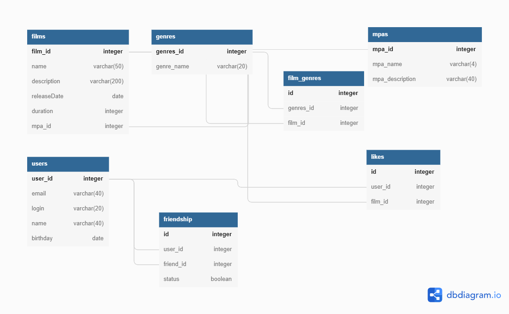

# java-filmorate

Template repository for Filmorate project.

# Описание БД

1.Таблица Users
user_id Id Пользователя
email email,
login login,
name имя пользователя,
birthday дата рождения.

2. Таблица Films
   film_id id Фильма,
   name название,
   description описание,
   releaseDate дата выхода,
   rate рэтинг,
   duration продолжительностьб
   mpa_id id МПА из Mpas
3. Tаблица Genres
   genres_id id жанра,
   genre_name имя жанра должнобыть уникальным
4. Таблица Film_genres для связи фильма и жанра
   id id,
   genres_id id жанра,
   film_id id Фильма
5. Таблица Mpas
   mpa_id          id MPA,
   mpa_name        имя уникалmное, not null ,
   mpa_description описание Mpa
6. Таблица FriendShip
   id       id,
   user_id   id пользовотеля из users,
   friend_id id друга из users,
   status    статус дружбы true - подтвеждена,
   уникальная пара user_id и friend_id
7. Таблица likes
   id     id,
   user_id id пользовотеля из users,
   film_id id фильма из films,
   уникальная пара user_id, film_id;
   